<div align="center">

<!-- Terminal-style animated profile README. Customize profile.json first. -->

<h3><code>koushik@github ~ $ ./contributions.sh</code></h3>



<br><br>

<h3><code>koushik@github ~ $ whoami</code></h3>

<table>
<tr>
<td valign="top"></td>
<td valign="top"></td>
</tr>
</table>

<br><br>

<h3><code>koushik@github ~ $ ./links.sh</code></h3>

<p><b>Business Intelligence and Automation Expert</b></p>

[](https://www.linkedin.com/in/koushik-bhandary-ai)
[](mailto:koushiknox@gmail.com)
[](mailto:koushik.bhandary@alchemy-research.com)

<br>

</div>

## Local setup

1. Edit [`profile.json`](./profile.json) with your GitHub username, display name, terminal handle, and photo filename.
2. Put your portrait at the repository root using that filename. A well-lit, high-contrast photo works best.
3. Install dependencies and generate the portrait:

   ```bash
   python -m pip install -r scripts/requirements-photo.txt
   python scripts/prep_photo.py source-photo.jpg source-prepped.png
   python scripts/make_ascii_svg.py source-prepped.png profile-ascii.svg
   ```

4. Fetch your contribution data and render the live cards:

   ```bash
   python scripts/fetch_contributions.py
   python scripts/render_heatmap_svg.py
   python scripts/render_stats_svg.py
   ```

The GitHub Action in [`.github/workflows/update-profile-art.yml`](./.github/workflows/update-profile-art.yml) repeats the data fetch and SVG rendering daily. It uses GitHub’s public contribution HTML endpoint, so no personal access token is required.
